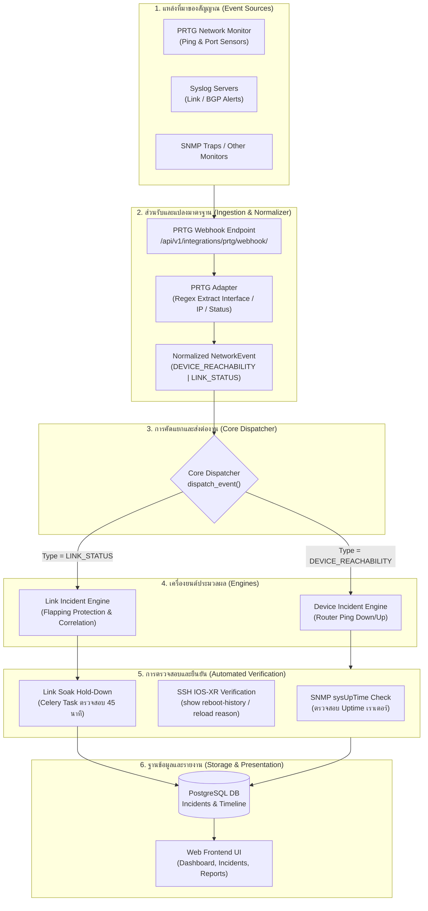
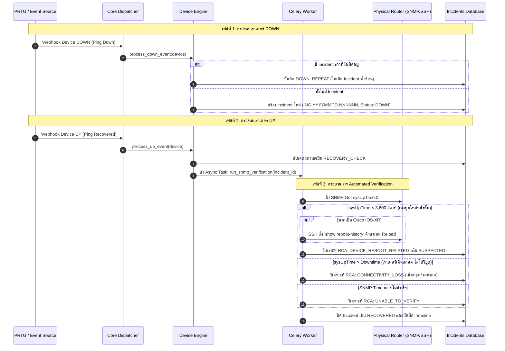
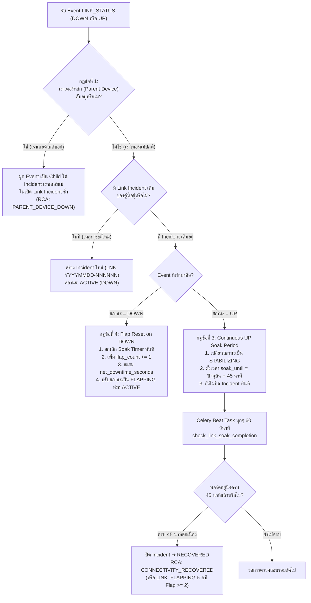
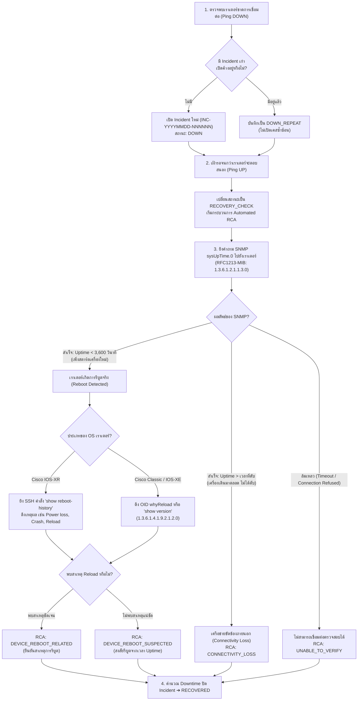
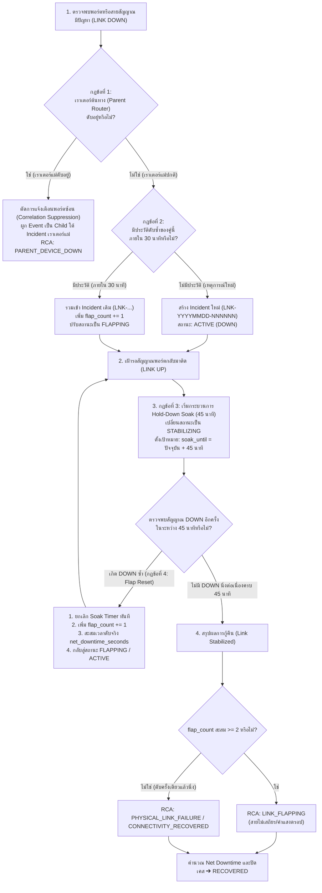
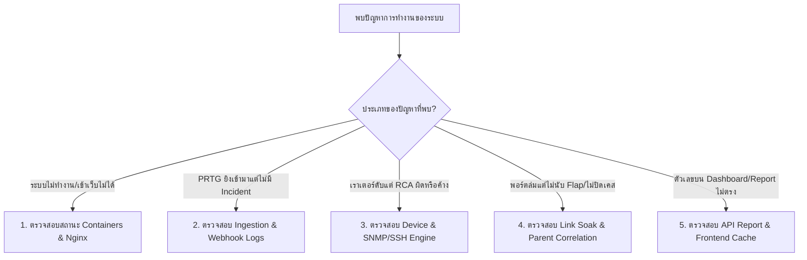

# Workflow การทำงานของระบบ Multi-Source Network Event & Incident Analysis Platform

เอกสารฉบับนี้อธิบาย **Workflow การทำงานของระบบ Multi-Source Network Event & Incident Analysis Platform** ทั้งหมด ตั้งแต่การรับ Event เข้ามา ไปจนถึงการวิเคราะห์หาสาเหตุรากเหง้า (RCA) และการประมวลผลรายงานเชิงลึก

---

## 1. ภาพรวมสถาปัตยกรรมของระบบ (System Architecture Overview)

ระบบทำงานในรูปแบบ Microservices Containerized Stack บน Docker ประกอบด้วย:
* **Nginx Reverse Proxy** (Port `8089`): รับ Webhook และเป็น Gateway สำหรับ Frontend/Backend
* **Backend API & Dispatcher** (`Django / DRF`): ทำหน้าที่ Normalize ข้อมูล, State Machine และคำนวณสถิติ
* **Celery Worker & Beat Scheduler** (`tasks.py`): ประมวลผล Async Tasks (SNMP/SSH Verification และตรวจสอบ Soak Timer 45 นาที)
* **Redis**: Message Broker สำหรับ Celery และ In-memory Cache
* **PostgreSQL**: จัดเก็บ Device, Event, Incident, Timeline และ Audit Logs
* **Frontend SPA** (`React / Vite / Tailwind`): หน้า Dashboard, Incident Timeline และ Report Drill-down



---

## 2. ขั้นตอนที่ 1: การรับสัญญาณและการแปลงข้อมูลมาตรฐาน (Normalization Layer)

ระบบไม่นำฟิลด์เฉพาะของ PRTG หรือยี่ห้อของมอนิเตอร์เข้ามาปะปนใน Business Logic แต่จะทำการ **Normalize** ให้เป็นมาตรฐานเดียวกันก่อนเสมอ:

1. **รับ Payload ดิบ (Ingestion)**:
   - PRTG ยิง Webhook HTTP POST เข้ามาที่ endpoint `/api/v1/integrations/prtg/webhook/` (`backend/integrations/prtg/views.py`)
2. **การแปลงข้อมูล (Adaptation)**:
   - เรียกใช้ `PRTGAdapter.normalize_payload` (`backend/integrations/prtg/adapter.py`):
     - ดึง IP address ของเราเตอร์ต้นทาง
     - ตรวจสอบประเภทเซนเซอร์: ถ้าเป็น Ping/Reachability จะระบุเป็น `EventType.DEVICE_REACHABILITY` แต่ถ้าเป็นเซนเซอร์ Port/Traffic จะระบุเป็น `EventType.LINK_STATUS`
     - ใช้ Regular Expression ที่ผ่านการปรับแต่งขั้นสูงเพื่อสกัดชื่อ Interface เช่น `HundredGigE0/1/0/0`, `TenGigE0/0/0/31`, `Vlan56`
     - แมปสถานะ Down/Up ให้เป็น `EventStatus.DOWN` หรือ `EventStatus.UP`
3. **จับคู่กับอุปกรณ์ในระบบ (Device Matching)**:
   - ค้นหาในตาราง `Device` (`backend/devices/models.py`) ด้วย Management IP เพื่อดึงข้อมูล Hostname, รุ่นเราเตอร์ (Hardware Model), จังหวัด และภูมิภาค
4. **บันทึกลงตาราง NetworkEvent**:
   - บันทึกประวัติ Event ทุกตัวลงฐานข้อมูลเพื่อใช้ทำ Audit Trail และส่งต่อไปยัง `dispatch_event()` (`backend/events/engine.py`)

---

## 3. ขั้นตอนที่ 2: การคัดแยกประเภทเหตุการณ์ (Core Event Dispatching)

ที่ `backend/events/engine.py` จะทำการตรวจสอบ `event.event_type`:
* **`DEVICE_REACHABILITY`** ➔ ส่งต่อไปยัง **Device Incident Engine** (`backend/incidents/engine.py`)
* **`LINK_STATUS`** ➔ ส่งต่อไปยัง **Link Incident Engine** (`backend/incidents/link_engine.py`)

---

## 4. ขั้นตอนที่ 3: Workflow การทำงานของ Device Reachability Engine (เราเตอร์หลักดับ)

ออกแบบมาเพื่อติดตามการล่มของเราเตอร์ และพิสูจน์ทราบว่า **"เราเตอร์ดับเพราะไฟดับ/รีบูตจริง (Reboot)"** หรือ **"เกิดจากระบบเครือข่ายขัดข้อง (Connectivity Loss)"**



---

## 5. ขั้นตอนที่ 4: Workflow การทำงานของ Link Incident Engine (สายสัญญาณและพอร์ตล่ม)

ออกแบบตาม **Carrier-Grade Standards** เพื่อแก้ปัญหาพอร์ตกระพริบ (Flapping Alert Storm) และการผูกความสัมพันธ์กับเราเตอร์แม่:



### 4 กฎเหล็กของ Link Engine:
1. **Parent Device Correlation**: เมื่อเราเตอร์ต้นทางดับ พอร์ตทั้งหมดภายใต้เราเตอร์จะดับตาม ระบบจะไม่สแปมเปิด Link Incident นับร้อยรายการ แต่จะจัดกลุ่มไปอยู่ใต้เหตุการณ์ของเราเตอร์หลัก
2. **Flapping Window (30 นาที)**: หากพอร์ตเกิดดับหรือติดซ้ำภายใน 30 นาที ระบบจะรวมอยู่ใน Incident เดียวกัน (`LNK-YYYYMMDD-NNNNNN`) และนับ Flap Cycle สะสม
3. **Continuous UP Soak Timer (45 นาที)**: เมื่อพอร์ตกลับมาติด (UP) ระบบจะไม่สรุปว่าหายทันที แต่จะให้อยู่ในสถานะ `STABILIZING (รอดูอาการ)` เป็นเวลา 45 นาทีเต็ม
4. **Flap Reset on DOWN**: หากในระหว่างที่รอดูอาการ 45 นาที พอร์ตเกิดหลุดลงไปอีก (DOWN) ระบบจะยกเลิกการนับเวลา 45 นาทีทันที, สะสมเวลาขาดจริง (`net_downtime_seconds`), เพิ่มรอบ Flap และกลับสู่สถานะดับ เพื่อรอจนกว่าจะติดใหม่

---

## 6. ขั้นตอนที่ 5: Monitoring, Analytics & Reporting Engine

ข้อมูลทั้งหมดที่ประมวลผลเสร็จสิ้นจะถูกนำไปนำเสนอผ่าน 3 หน้าจอหลักบน Frontend:

1. **Dashboard View (`frontend/src/components/DashboardView.tsx`)**:
   - แสดงสถิติ Real-time 6 KPI Cards (เราเตอร์ดับ, พอร์ตดับ, พอร์ตกระพริบ, อยู่ระหว่างรอดูอาการ, กู้คืนแล้ว)
   - สรุปความพร้อมของโครงข่าย (Network Availability & Health Rate)
2. **Incidents Management View (`frontend/src/components/IncidentsView.tsx`)**:
   - แยกแท็บดูได้ 3 มุมมอง: `All Incidents`, `Device Outages (INC-...)`, `Link Outages (LNK-...)`
   - คลิกเพื่อดู **Timeline Interaction & Root Cause Evidence** (หลักฐานผลลัพธ์ SNMP sysUpTime, ประวัติคำสั่ง SSH)
3. **Geographical & Interface Report View (`frontend/src/components/ReportView.tsx`)**:
   - สลับมุมมองรายงานได้ 3 โหมด: **Link Report**, **Device Report**, และ **Combined Overview**
   - **Hierarchical Drill-Down**: เจาะลึก 4 ระดับ:
     $$\text{ภาค (Region)} \longrightarrow \text{จังหวัด (Province)} \longrightarrow \text{เราเตอร์หลัก (Device)} \longrightarrow \text{พอร์ต/วงจรย่อย (Interface)}$$
   - ตารางจัดอันดับพอร์ตที่ไม่เสถียรที่สุด (**Top 10 Most Unstable Interfaces**) สำหรับส่งต่อให้ทีมผู้ให้บริการโครงข่าย/สายสัญญาณ (Telco / Transmission)
   - ส่งออกข้อมูลเป็น **Excel / CSV** พร้อมรองรับภาษาไทย และสามารถสั่งพิมพ์เป็น **PDF Report** ได้ทันที

---

## 7. โครงสร้างไฟล์และโมดูลสำคัญ (Key File References)

| ลำดับ | โมดูล / ไฟล์ | หน้าที่และความรับผิดชอบ |
| :--- | :--- | :--- |
| 1 | `backend/integrations/prtg/views.py` | Webhook HTTP POST Endpoint สำหรับรับ Payload จาก PRTG |
| 2 | `backend/integrations/prtg/adapter.py` | ตัว Normalize สกัด Interface Name, Router IP และ Event Type |
| 3 | `backend/events/engine.py` | Core Event Dispatcher คัดแยกระหว่าง Device และ Link Event |
| 4 | `backend/incidents/engine.py` | State Machine ของ Device Outage (Down / Up / Recovery Check) |
| 5 | `backend/incidents/link_engine.py` | State Machine ของ Link Outage (30m Flap Window, 45m Soak Period, Parent Correlation) |
| 6 | `backend/incidents/tasks.py` | Celery Scheduled Task ตรวจสอบการครบเวลา 45 นาทีของ Link Soak |
| 7 | `backend/verification/engine.py` | ยิง SNMP sysUpTime และ SSH IOS-XR เพื่อค้นหาสาเหตุการรีบูต |
| 8 | `backend/incidents/views.py` | API รายงานเชิงลึก (`IncidentReportView`) รองรับฟิลเตอร์ตามภูมิภาคและประเภท |
| 9 | `frontend/src/components/ReportView.tsx` | หน้า UI รายงาน Drill-down ระดับ Interface พร้อม Export CSV |
| 10 | `frontend/src/components/IncidentsView.tsx` | หน้า UI จัดการ Incident แสดง Badge พอร์ต และไทม์ไลน์ |

---

## 8. ขั้นตอนการตรวจสอบและวินิจฉัยปัญหาเครือข่ายเชิงลึก: Node Down และ Link เสีย (Network Fault Diagnostic Procedures)

หมวดนี้อธิบายขั้นตอนการปฏิบัติการตรวจสอบและวินิจฉัยปัญหาทางเครือข่ายอย่างละเอียด โดยแบ่งออกเป็น 2 กรณีหลัก: **การตรวจสอบปัญหา Node Down (เราเตอร์หลักดับ)** และ **การตรวจสอบปัญหา Link เสีย (สายสัญญาณและพอร์ตล่ม/กระพริบ)**

---

### 8.1 ขั้นตอนการตรวจสอบปัญหา Node Down (Device / Router Reachability Diagnosis)

เมื่อเราเตอร์หรืออุปกรณ์หลักขาดการเชื่อมต่อ (Ping Down) วัตถุประสงค์หลักคือ **"การพิสูจน์ทราบว่าเครื่องดับ/รีบูตจริง หรือเครือข่ายภายนอกขาดหายไป"**



#### รายละเอียดขั้นตอนการดำเนินงาน:
1. **ขั้นตอนที่ 1: ตรวจจับและรับรู้การขาดการเชื่อมต่อ (Detection & De-duplication)**:
   - ตรวจจับ ICMP Ping Echo Timeout จาก PRTG
   - ระบบตรวจสอบในตาราง Incident หากมีเคสเปิดอยู่แล้ว จะทำการบันทึก Timeline เป็น `DOWN_REPEAT` พร้อมอัปเดตเวลา `last_seen` เพื่อป้องกันปัญหาการเปิดเคสซ้ำซ้อน
2. **ขั้นตอนที่ 2: รอการตอบสนองและเริ่มต้นการตรวจสอบ (Recovery Trigger)**:
   - เมื่อเราเตอร์ Ping กลับมาติด จะเข้าสู่สถานะ `RECOVERY_CHECK`
   - ระบบตั้งเวลา `up_time` และสั่งงาน Celery Task แบบ Asynchronous เพื่อไม่ให้บล็อกการทำงานหลัก
3. **ขั้นตอนที่ 3: กระบวนการตรวจพิสูจน์สาเหตุรากเหง้า (RCA Automated Verification)**:
   - **การส่งคำสั่ง SNMP `sysUpTime` (OID `1.3.6.1.2.1.1.3.0`)**:
     - ค่าที่ได้เป็นหน่วยร้อยละของวินาที (Hundredths of a second) แปลงเป็นวินาที (`uptime_seconds`)
     - คำนวณเวลาบูตโดยประมาณ: $\text{Estimated Boot Time} = \text{Check Time} - \text{Uptime Seconds}$
   - **การจำแนกผลลัพธ์ (Classification Logic)**:
     - **กรณี A: เราเตอร์รีบูตจริง (`uptime_seconds < 3,600 วินาที`)**:
       - ตัวเครื่องเพิ่งสตาร์ตใหม่หลังจากดับลงไป
       - **หากเป็น Cisco IOS-XR**: ระบบเชื่อมต่อผ่าน SSH พอร์ต 22 รันคำสั่ง `show reboot-history` สกัดผลลัพธ์ เช่น `Power loss`, `Reload command by user`, `Kernel panic`, `Card reset`
       - **หากเป็น Cisco IOS/IOS-XE**: ตรวจสอบ SNMP OID `whyReload` (`1.3.6.1.4.1.9.2.1.2.0`)
       - จัดหมวดหมู่เป็น `DEVICE_REBOOT_RELATED` (High Confidence) หากพบข้อความสาเหตุ หรือ `DEVICE_REBOOT_SUSPECTED` หากเวลาตรงแต่ดึงข้อความไม่ได้
     - **กรณี B: เราเตอร์ไม่ได้รีบูต (`uptime_seconds > ระยะเวลาที่ดับ`)**:
       - เช่น เครื่องดับไป 5 นาที แต่ Uptime นับได้ 180 วัน แสดงว่าตัวเครื่องไม่เคยดับ ไม่เคยไฟตก
       - จัดหมวดหมู่เป็น `CONNECTIVITY_LOSS` (สายสัญญาณ Uplink หรือเครือข่ายของ Transmission Provider ขาดหายไปชั่วคราว)
     - **กรณี C: ติดต่อไม่ได้ (SNMP Timeout / Auth Failure)**:
       - จัดหมวดหมู่เป็น `UNABLE_TO_VERIFY` ส่งต่อให้ทีมวิศวกรเข้าตรวจผ่าน Console
4. **ขั้นตอนที่ 4: สรุป Downtime และปิด Incident (Resolution & Logging)**:
   - คำนวณ Downtime: $\text{Downtime} = \text{up\_time} - \text{down\_time}$
   - เปลี่ยนสถานะเป็น `RECOVERED` และบันทึกหลักฐานทั้งหมดลงใน Incident Timeline

---

### 8.2 ขั้นตอนการตรวจสอบปัญหา Link เสีย (Link / Circuit & Flapping Diagnosis)

เมื่อสายสัญญาณหรือพอร์ตขัดข้อง (Port Down, Packet Loss, Interface Error) วัตถุประสงค์หลักคือ **"การแยกแยะระหว่างสายขาดจริง, พอร์ตกระพริบไม่เสถียร, หรือดับเพราะเครื่องแม่ล่ม"**



#### รายละเอียดขั้นตอนการดำเนินงาน:
1. **ขั้นตอนที่ 1: ตรวจสอบการพึ่งพาอุปกรณ์แม่ (Parent Device Dependency Check)**:
   - ตรวจสอบทันทีก่อนว่าเราเตอร์ต้นทาง (Parent Device) ติดสถานะ `DOWN` หรือไม่
   - หากเราเตอร์แม่ดับอยู่ จะจัดหมวดหมู่วงจรนั้นเป็น `PARENT_DEVICE_DOWN` และไม่สร้าง Link Incident ใหม่ เพื่อป้องกัน Alert Storm นับร้อยพอร์ตเมื่อเราเตอร์ตัวหลักดับ
2. **ขั้นตอนที่ 2: วิเคราะห์พฤติกรรมการดับและการกระพริบ (Fault Pattern Analysis)**:
   - ตรวจสอบประวัติของพอร์ตนั้นภายในหน้าต่างเวลา 30 นาที (`FLAP_WINDOW = 30m`):
     - **รูปแบบ A: ดับยาวต่อเนื่อง (Physical Link Failure)**: สายขาด (Fiber Cut), อุปกรณ์ฝั่งตรงข้ามดับ, SFP Module ชำรุด
     - **รูปแบบ B: พอร์ตกระพริบซ้ำๆ (Link Flapping)**: พอร์ตดับแล้วติดสลับกันบ่อยครั้งภายใน 30 นาที (ค่าแสงดรอป Optical Attenuation สูง, คอนเน็กเตอร์สกปรก, สายไฟเบอร์งอเกินรัศมี Bending Radius) ➔ ระบบนับรอบ `flap_count += 1` และสะสมเวลาขาดจริง `net_downtime_seconds`
     - **รูปแบบ C: แอดมินปิดพอร์ตเอง (Admin Shutdown)**: ตรวจสอบสถานะ `ifAdminStatus = DOWN`
3. **ขั้นตอนที่ 3: กระบวนการพิสูจน์ความเสถียร (Continuous UP Hold-Down Soak 45 นาที)**:
   - เมื่อพอร์ตส่งสัญญาณ UP กลับเข้ามา ระบบจะ**ยังไม่สรุปว่าสายซ่อมเสร็จหรือใช้งานได้ปกติ**
   - พอร์ตจะเข้าสู่สถานะ **`STABILIZING`** และเริ่มนับถอยหลัง 45 นาที (`soak_until`)
   - **กฎการ Reset เมื่อเกิด Down ซ้ำ (Flap Reset on DOWN)**: หากในระหว่างที่รอดูอาการ พอร์ตเกิดหลุดลงไปอีกแม้แต่วินาทีเดียว ระบบจะยกเลิกเวลารอดูอาการทันที, เพิ่มรอบ Flap, คำนวณเวลาที่ดับจริงสะสม (`net_downtime_seconds`) และรอจนกว่าจะติดใหม่
   - **การยืนยันการกู้คืน**: หากพอร์ตอยู่นิ่งต่อเนื่องครบ 45 นาทีเต็ม Celery Beat Task (`check_link_soak_completion`) จะเปลี่ยนสถานะเป็น `RECOVERED` โดยอัตโนมัติ
4. **ขั้นตอนที่ 4: การสรุป Net Downtime และข้อมูลส่งต่อผู้ให้บริการ (Impact Assessment & Escalation)**:
   - ระบบแยกแยะระหว่าง:
     - **Gross Duration**: ระยะเวลาตั้งแต่เริ่มดับครั้งแรกจนกระทั่งพอร์ตอยู่นิ่งครบ 45 นาที
     - **Net Downtime**: ระยะเวลาที่สายสัญญาณดับจริงสะสม (ไม่รวมช่วงเวลา 45 นาทีที่สายติดแล้วแต่รอดูอาการ)
   - ข้อมูลชื่อพอร์ต (`interface_name`), เราเตอร์แม่ (`sys_name`, `IP`), รอบการ Flap, และเวลารวม Net Downtime จะถูกสรุปไว้บนตาราง **Top 10 Most Unstable Interfaces** เพื่อให้ทีมวิศวกรนำไปประสานงานเปิด Ticket แจ้งซ่อมกับผู้ให้บริการสายสัญญาณ (Telco / Transmission Provider) ได้อย่างแม่นยำ

---

## 9. การตรวจสอบและบำรุงรักษาตัวระบบซอฟต์แวร์ (System & Platform Maintenance)

คู่มือนี้สรุปแนวทางการตรวจสอบ วินิจฉัย และแก้ไขปัญหาของระบบ Containers และ Infrastructure



---

### 9.1 การตรวจสอบสถานะระบบและ Containers (System Health Check)

หากหน้าเว็บเข้าไม่ได้ หรือคำสั่งงานไม่ประมวลผล ให้ตรวจสอบสุขภาพของ Containers ทั้ง 5 ตัวเป็นอันดับแรก:

1. **ตรวจสอบสถานะคอนเทนเนอร์**:
   ```bash
   docker ps --format "table {{.Names}}\t{{.Status}}\t{{.Ports}}"
   ```
   *คอนเทนเนอร์ทั้งหมด 5 ตัวต้องมีสถานะ `Up`:*
   - `eventanalyzer-frontend` (Port `8089->80`)
   - `eventanalyzer-backend` (Port `8000`)
   - `eventanalyzer-celery` (Celery Worker & Beat Scheduler)
   - `eventanalyzer-db` (PostgreSQL 5432)
   - `eventanalyzer-redis` (Redis 6379)

2. **ตรวจสอบการตอบสนองของ Nginx และ Backend API**:
   ```bash
   # ตรวจสอบ Frontend Nginx
   curl -s -I http://localhost:8089/
   
   # ตรวจสอบ Backend Dashboard API
   curl -s http://localhost:8089/api/v1/dashboard/summary/ | python3 -m json.tool | head -n 20
   ```

3. **คำสั่งตรวจสอบ Logs แบบ Real-time**:
   ```bash
   # ดู Log ข้อผิดพลาดของ Backend
   docker logs --tail 100 -f eventanalyzer-backend
   
   # ดู Log การทำงานของ Celery Worker & Scheduled Tasks
   docker logs --tail 100 -f eventanalyzer-celery
   
   # ดู Access/Error Log ของ Nginx Webhook
   docker logs --tail 100 -f eventanalyzer-frontend
   ```

---

### 9.2 การตรวจสอบปัญหา Webhook ไม่เข้า หรือไม่เปิด Incident (Ingestion Issues)

**อาการ**: PRTG แจ้งเตือนว่าเซนเซอร์ Down แต่ในระบบ Event Analyzer ไม่พบเหตุการณ์ใหม่

#### ขั้นตอนการตรวจสอบ:
1. **ตรวจสอบ Nginx Access Log ว่า PRTG ส่ง Webhook มาถึงหรือไม่**:
   ```bash
   docker logs --tail 50 eventanalyzer-frontend | grep "webhook"
   ```
   *ถ้าพบ HTTP `200 OK`: แปลว่า Webhook ส่งมาถึง Backend เรียบร้อย*  
   *ถ้าพบ HTTP `400` หรือ `500`: ตรวจสอบ Payload Format ว่า JSON เสียหายหรือไม่*  
   *ถ้าไม่พบ Log เลย: ให้ตรวจเช็ค Network Firewall, Routing ระหว่าง PRTG Server กับ Event Analyzer Server (Port 8089)*

2. **ตรวจสอบการบันทึก NetworkEvent ในฐานข้อมูล**:
   เปิด Django shell ตรวจสอบ Event ล่าสุด 5 รายการ:
   ```bash
   docker exec -it eventanalyzer-backend python manage.py shell -c "
   from events.models import NetworkEvent
   for e in NetworkEvent.objects.order_by('-created_at')[:5]:
       print(e.id, e.event_type, e.event_status, e.source_device_ip, e.metadata.get('interface_name'), e.created_at)
   "
   ```

3. **ตรวจสอบว่า IP ใน Webhook ตรงกับ Device ในระบบหรือไม่ (Unmatched Device)**:
   - หาก IP ของเราเตอร์ที่ส่งมาไม่มีอยู่ในตาราง `Device` ระบบจะบันทึกเป็นอุปกรณ์ชั่วคราวหรือไม่สามารถดึงข้อมูลพิกัดจังหวัด/ภูมิภาคได้
   - ตรวจสอบว่า IP นั้นถูกเพิ่มไว้ในเมนู **Devices** แล้วหรือยัง

4. **ตรวจสอบการสกัดชื่อ Interface จาก Payload (Regex Extraction)**:
   - หากเซนเซอร์เป็นแบบ Traffic หรือ Port Status ให้ตรวจสอบว่า Regex สกัดชื่อ Interface ได้หรือไม่ ผ่านคำสั่งทดสอบ:
   ```bash
   docker exec -it eventanalyzer-backend python manage.py shell -c "
   from integrations.prtg.adapter import PRTGAdapter
   sample = 'Traffic: (HundredGigE0/1/0/0) To_Core_Router'
   print('Extracted:', PRTGAdapter.extract_interface_name(sample))
   "
   ```

---

### 9.3 การตรวจสอบปัญหา Device Incident (เราเตอร์ดับแต่ไม่มี Incident หรือ RCA ผิด)

**อาการที่ 1**: เราเตอร์ Ping ไม่เจอ (Down) แต่ไม่มี Incident เปิดขึ้นมา  
**อาการที่ 2**: เราเตอร์กลับมาติด (UP) แล้ว แต่สถานะค้างที่ `RECOVERY_CHECK` หรือได้ผลวิเคราะห์ `UNABLE_TO_VERIFY`

#### ขั้นตอนการตรวจสอบ:
1. **ตรวจสอบการทำงานของ Celery Worker**:
   - เมื่อเราเตอร์ UP ระบบจะสั่งงาน Celery Task ชื่อ `run_snmp_verification`
   - ตรวจสอบว่า Celery ทำงานอยู่หรือไม่:
   ```bash
   docker logs --tail 100 eventanalyzer-celery | grep -E "run_snmp_verification|Task"
   ```

2. **ทดสอบคำสั่ง SNMP sysUpTime ไปยังเราเตอร์โดยตรง**:
   ทดสอบว่าเซิร์ฟเวอร์สามารถส่ง SNMP (UDP Port 161) ไปยังเราเตอร์ได้หรือไม่:
   ```bash
   docker exec -it eventanalyzer-backend python manage.py shell -c "
   from verification.snmp.snmp_v2 import SNMPv2Client
   client = SNMPv2Client()
   res = client.get_sysuptime(host='<ROUTER_IP>', community='public', timeout=3)
   print('Success:', res.success, 'Uptime:', res.router_uptime_seconds, 'Err:', res.error_message)
   "
   ```
   *หากได้ Timeout*:
   - ตรวจสอบ ACL / Firewall บนเราเตอร์ว่าอนุญาต IP ของ Event Analyzer หรือไม่
   - ตรวจสอบว่า SNMP Community String ถูกต้องหรือไม่ (ตั้งค่าได้ที่เมนู **Settings** ➔ `SNMP_COMMUNITY_DEFAULT`)

3. **ทดสอบการเชื่อมต่อ SSH สำหรับเราเตอร์ Cisco IOS-XR**:
   - หากเราเตอร์เพิ่งรีบูตและต้องการดึงประวัติคำสั่ง `show reboot-history`:
   ```bash
   docker exec -it eventanalyzer-backend python manage.py shell -c "
   from verification.ssh.xr_ssh import get_xr_reboot_history
   res = get_xr_reboot_history(host='<ROUTER_IP>', username='<USER>', password='<PASS>')
   print('Success:', res.get('success'), 'Reason:', res.get('parsed_reason'))
   "
   ```

---

### 9.4 การตรวจสอบปัญหา Link Incident (พอร์ตกระพริบ, Soak Timer ไม่ขยับ)

**อาการที่ 1**: พอร์ตดับ แต่ระบบไม่สร้าง Link Incident ใหม่ (`LNK-...`)  
**สาเหตุที่พบบ่อย**: **กฎข้อที่ 1 (Parent Correlation)**: หากเราเตอร์แม่ (Device) มี Incident `DOWN` เปิดค้างอยู่ พอร์ตทั้งหมดภายใต้เราเตอร์ตัวนั้นจะถูกมองว่าเป็นผลกระทบจากการที่เครื่องแม่ดับ และถูกผูกเป็น Child Event ทันที  
**วิธีตรวจสอบ**:
```bash
docker exec -it eventanalyzer-backend python manage.py shell -c "
from incidents.models import Incident
from common.constants import IncidentType, IncidentStatus
active_dev = Incident.objects.filter(incident_type=IncidentType.DEVICE, status__in=IncidentStatus.ACTIVE_STATUSES)
print('Active Router Downs:', [(i.incident_number, i.primary_device.name) for i in active_dev])
"
```

---

**อาการที่ 2**: พอร์ตกลับมาติดแล้ว (UP) แต่สถานะค้างที่ `STABILIZING (SOAK)` ไม่ยอมปิดเป็น `RECOVERED`  
**สาเหตุที่พบบ่อย**:
1. พอร์ตยังอยู่นิ่งไม่ครบ 45 นาที (กฎข้อที่ 3 Continuous UP Soak Timer)
2. Celery Beat Scheduler ไม่ได้รัน Task `check_link_soak_completion`

**วิธีตรวจสอบ**:
1. ดูเวลาเป้าหมาย `soak_until` ของ Incident นั้น:
   ```bash
   docker exec -it eventanalyzer-backend python manage.py shell -c "
   from incidents.models import Incident
   from common.constants import IncidentType
   from django.utils import timezone
   for inc in Incident.objects.filter(incident_type=IncidentType.LINK, status='STABILIZING'):
       diff = (inc.soak_until - timezone.now()).total_seconds() if inc.soak_until else 0
       print(inc.incident_number, inc.interface_name, 'Soak Until:', inc.soak_until, f'Remaining: {int(diff)}s')
   "
   ```
2. ทดสอบสั่งรัน Task ตรวจสอบ Soak ทันทีผ่าน CLI:
   ```bash
   docker exec -it eventanalyzer-backend python manage.py shell -c "
   from incidents.tasks import check_link_soak_completion
   result = check_link_soak_completion()
   print('Soak Task Run Result:', result)
   "
   ```

---

**อาการที่ 3**: พอร์ตหลุดบ่อยแต่ `flap_count` ไม่เพิ่มขึ้น  
**สาเหตุ**: เหตุการณ์ที่เกิดซ้ำห่างกันเกิน 30 นาที (`FLAP_WINDOW_SECONDS = 1800`) ระบบจึงตัดเป็นคนละเหตุการณ์ตามมาตรฐาน

---

### 9.5 การตรวจสอบปัญหาหน้า Dashboard และ Report (สถิติไม่ขึ้น หรือตัวเลขไม่ตรง)

1. **ตรวจสอบความถูกต้องของข้อมูลผ่าน API Endpoint โดยตรง**:
   ```bash
   # ตรวจสอบรายงานโหมด Link
   curl -s "http://localhost:8089/api/v1/incidents/report/?preset=today&incident_type=link" | python3 -c "
   import sys, json; d = json.load(sys.stdin)
   print('Total Link Incidents:', d['summary']['total_incidents'])
   print('Flap Cycles:', d['summary']['total_flap_cycles'])
   "
   
   # ตรวจสอบรายงานโหมด Device
   curl -s "http://localhost:8089/api/v1/incidents/report/?preset=today&incident_type=device" | python3 -c "
   import sys, json; d = json.load(sys.stdin)
   print('Total Device Incidents:', d['summary']['total_incidents'])
   "
   ```

2. **หากแก้ไขโค้ด Frontend แล้วหน้าจอไม่เปลี่ยนแปลง**:
   ต้องทำการ Rebuild Vite และ Reload Nginx เสมอ:
   ```bash
   cd /root/container/event-analyzer/frontend && npx vite build
   docker exec eventanalyzer-frontend nginx -s reload
   ```

---

### 9.6 ชุดคำสั่งลัดสำหรับผู้ดูแลระบบ (Administrator Diagnostic Cheatsheet)

| งานที่ต้องการทำ | คำสั่งที่ใช้ |
| :--- | :--- |
| **ดูสถานะ Container ทั้งหมด** | `docker ps` |
| **ดู Log Backend สด** | `docker logs --tail 50 -f eventanalyzer-backend` |
| **ดู Log Celery Worker สด** | `docker logs --tail 50 -f eventanalyzer-celery` |
| **รีสตาร์ท Backend & Worker** | `docker restart eventanalyzer-backend eventanalyzer-celery` |
| **Rebuild Frontend ทันที** | `cd /root/container/event-analyzer/frontend && npx vite build && docker exec eventanalyzer-frontend nginx -s reload` |
| **ดูจำนวน Incident แยกตามประเภท** | `docker exec -it eventanalyzer-backend python manage.py shell -c "from incidents.models import Incident; from django.db.models import Count; print(list(Incident.objects.values('incident_type', 'status').annotate(total=Count('id'))))"` |
| **ทดสอบจำลอง Webhook พอร์ตดับ (Mock Link Down)** | `curl -X POST http://localhost:8089/api/v1/integrations/prtg/webhook/ -H "Content-Type: application/json" -d '{"sensor":"Traffic (TenGigE0/0/0/1)","status":"Down","device":"Router-01","ip":"10.0.10.1","message":"Link down on port"}'` |
| **ทดสอบจำลอง Webhook พอร์ตติด (Mock Link Up)** | `curl -X POST http://localhost:8089/api/v1/integrations/prtg/webhook/ -H "Content-Type: application/json" -d '{"sensor":"Traffic (TenGigE0/0/0/1)","status":"Up","device":"Router-01","ip":"10.0.10.1","message":"Link restored"}'` |

