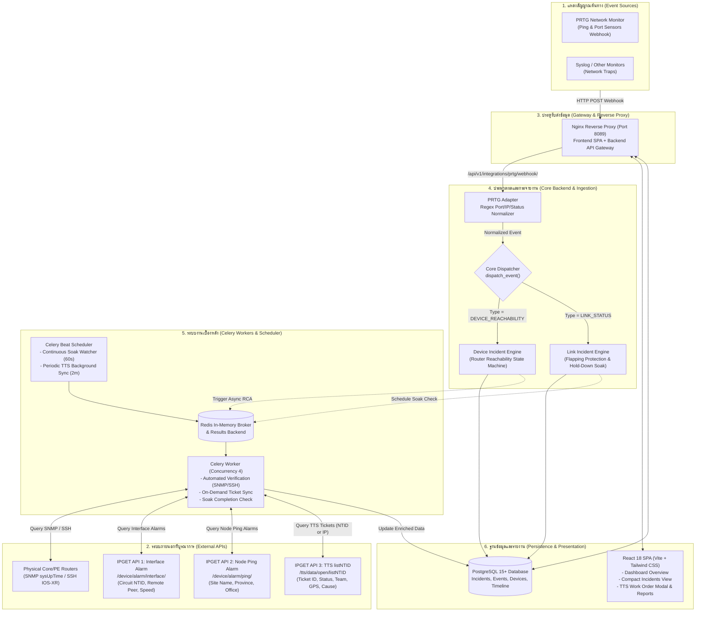
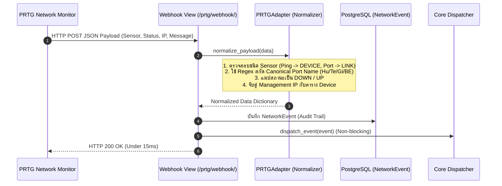
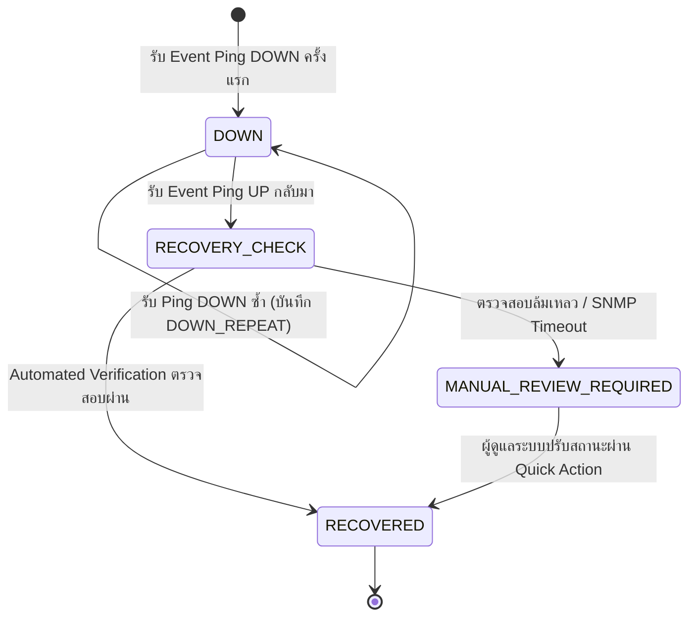
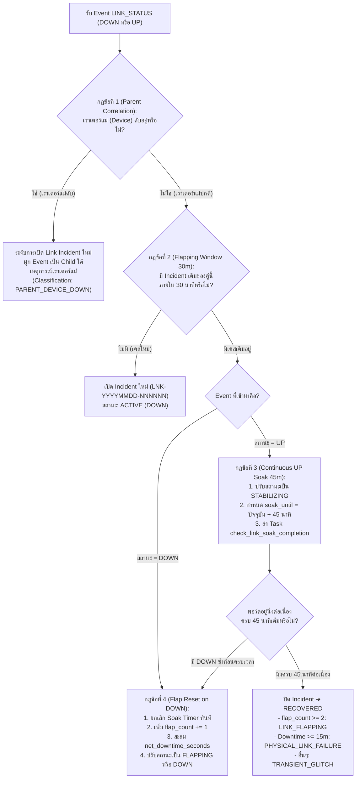
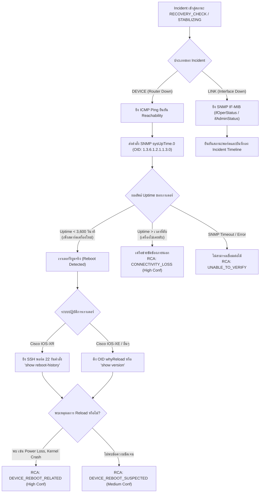
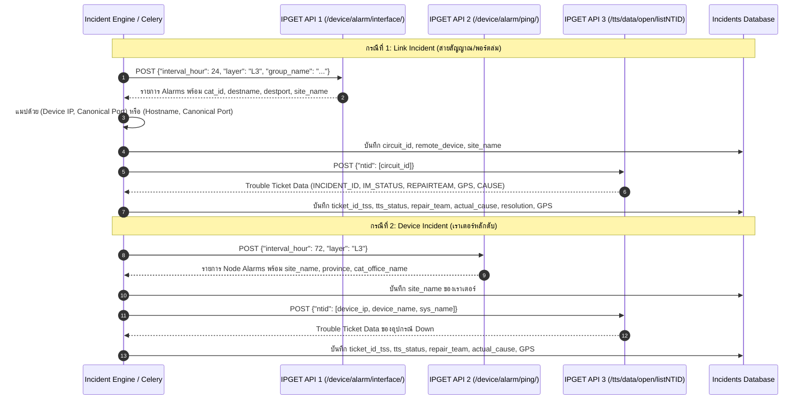
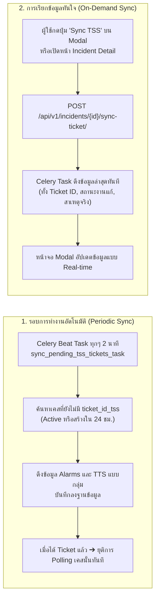
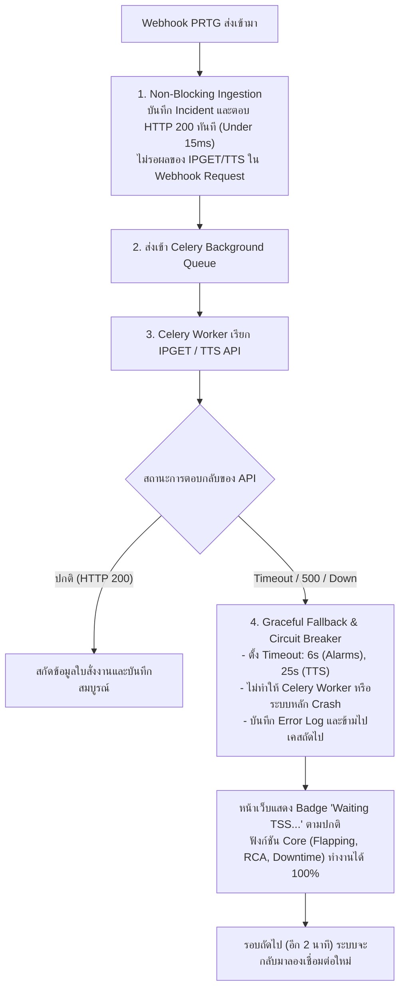
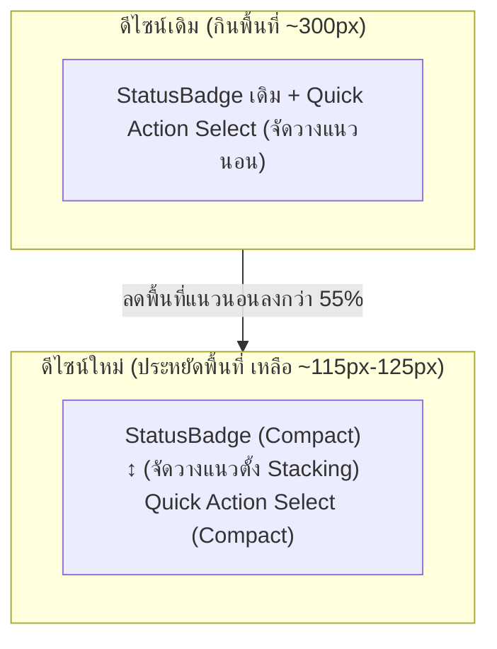

# คู่มือการทำงานของระบบ Multi-Source Network Event & Incident Analysis Platform (ฉบับปรับปรุงล่าสุด)
**System Workflow & Architecture Specification (Updated Edition)**

เอกสารฉบับนี้อธิบาย **Workflow การทำงานของระบบ Multi-Source Network Event & Incident Analysis Platform** ทั้งหมดที่ได้รับการอัปเดต โดยครอบคลุมทั้งสถาปัตยกรรมหลัก, กลไก State Machine การคัดแยกความผิดปกติ, ระบบบูรณาการเชื่อมต่อ **IPGET API Suite** และ **TTS Trouble Ticket System** ล่าสุด, ระบบ Automated Verification, โครงสร้างฐานข้อมูลที่ขยายใหม่, การปรับปรุง User Interface (UI/UX) และมาตรการความทนทานต่อข้อผิดพลาด (Fault Tolerance)

---

## สารบัญ (Table of Contents)
1. [ภาพรวมสถาปัตยกรรมระบบหลังการอัปเดต (Updated System Architecture)](#1-ภาพรวมสถาปัตยกรรมระบบหลังการอัปเดต)
2. [ขั้นตอนที่ 1: การรับสัญญาณและการสกัดข้อมูลมาตรฐาน (Ingestion & Normalization Layer)](#2-ขั้นตอนที่-1-การรับสัญญาณและการสกัดข้อมูลมาตรฐาน)
3. [ขั้นตอนที่ 2: Core Dispatcher และ State Machine การจัดการ Incident](#3-ขั้นตอนที่-2-core-dispatcher-และ-state-machine-การจัดการ-incident)
4. [ขั้นตอนที่ 3: ระบบตรวจพิสูจน์สาเหตุรากเหง้าอัตโนมัติ (Automated RCA & Verification Engine)](#4-ขั้นตอนที่-3-ระบบตรวจพิสูจน์สาเหตุรากเหง้าอัตโนมัติ)
5. [ขั้นตอนที่ 4: สถาปัตยกรรมและการเชื่อมต่อ IPGET & TTS Integration Suite](#5-ขั้นตอนที่-4-สถาปัตยกรรมและการเชื่อมต่อ-ipget--tts-integration-suite)
6. [ขั้นตอนที่ 5: มาตรการรักษาเสถียรภาพ ประสิทธิภาพ และการรับมือเมื่อ API ขัดข้อง (Resilience & Fault Tolerance)](#6-ขั้นตอนที่-5-มาตรการรักษาเสถียรภาพ-ประสิทธิภาพ-และการรับมือเมื่อ-api-ขัดข้อง)
7. [ขั้นตอนที่ 6: การปรับปรุงการแสดงผลและ User Experience (Frontend UI/UX Optimization)](#7-ขั้นตอนที่-6-การปรับปรุงการแสดงผลและ-user-experience)
8. [โครงสร้างฐานข้อมูลและฟิลด์ที่ได้รับการขยาย (Database Schema Reference)](#8-โครงสร้างฐานข้อมูลและฟิลด์ที่ได้รับการขยาย)
9. [คู่มือการทดสอบ ตรวจสอบ และวินิจฉัยระบบ (System Verification & Diagnostic Guide)](#9-คู่มือการทดสอบ-ตรวจสอบ-และวินิจฉัยระบบ)

---

## 1. ภาพรวมสถาปัตยกรรมระบบหลังการอัปเดต

ระบบทำงานในรูปแบบ **Containerized Microservices Stack** บน Docker โดยแยกหน้าที่กันอย่างชัดเจน และเชื่อมต่อกับระบบภายนอกแบบ Non-blocking:



### องค์ประกอบสำคัญของระบบ:
1. **Nginx Reverse Proxy** (Port `8089`): ทำหน้าที่เป็น Single Entry Point สำหรับทั้ง Webhook Ingestion, Backend REST API และให้บริการ Static Assets ของ React Frontend
2. **Backend API & Dispatcher** (`Django 5.x / DRF`): ทำหน้าที่ Ingest Event, รัน State Machine, คำนวณความเสถียร และให้บริการ REST API
3. **Celery Worker & Beat** (`Celery 5.x`): แยกการประมวลผลงานหนัก เช่น SNMP/SSH Verification, Soak Timer 45 นาที และการเชื่อมโยงข้อมูล IPGET/TTS ออกจาก Webhook Thread
4. **Redis 7.x**: จัดการ Message Queue ระหว่าง Django และ Celery Worker
5. **PostgreSQL 15+**: จัดเก็บตารางข้อมูลเชิงสัมพันธ์ที่มี ACID Guarantee พร้อมรองรับ Concurrent Status Locks
6. **Frontend SPA** (`React 18 / TypeScript / Vite / Tailwind`): นำเสนอข้อมูล Dashboard, ตาราง Incident แบบ Compact พร้อม Quick Actions, Modal แสดงรายละเอียดการซ่อม TTS และรายงานแบบ Hierarchical Drill-down

---

## 2. ขั้นตอนที่ 1: การรับสัญญาณและการสกัดข้อมูลมาตรฐาน

ระบบรองรับ Event จากอุปกรณ์ตรวจวัด (Monitoring) หลากหลายค่าย โดยมีกระบวนการแปลงข้อมูล (Normalization Pipeline) เพื่อไม่ให้โครงสร้างเฉพาะของ PRTG หรือ Syslog ปะปนกับ Core Business Logic:



### การสกัดข้อมูลและแปลงรูปแบบพอร์ต (Interface Normalization):
ฟังก์ชัน `IPGETClient.normalize_port_name()` และ `PRTGAdapter.extract_interface_name()` จะทำความสะอาดชื่อพอร์ตให้อยู่ใน Canonical Short Form สากล เพื่อให้จับคู่ได้แม่นยำ 100%:
* `HundredGigE0/1/0/0` $\rightarrow$ `hu0/1/0/0`
* `TenGigabitEthernet0/0/0/31` หรือ `TenGigE0/0/0/31` $\rightarrow$ `te0/0/0/31`
* `GigabitEthernet0/1/2` $\rightarrow$ `gi0/1/2`
* `Bundle-Ether1` $\rightarrow$ `be1`

---

## 3. ขั้นตอนที่ 2: Core Dispatcher และ State Machine การจัดการ Incident

Core Dispatcher (`backend/events/engine.py`) จะตรวจสอบ `event.event_type` เพื่อส่งต่องานไปยัง Engine ที่รับผิดชอบโดยเฉพาะ:

### 3.1 Device Reachability Engine (เมื่อเราเตอร์หลักดับ)
มุ่งเน้นการตรวจจับการขาดหายไปของอุปกรณ์ (Node Down) และการป้องกันปัญหาเปิดเคสซ้ำซ้อน:



* **De-duplication**: หากได้รับ Ping DOWN ซ้ำในขณะที่ Incident เดิมยังไม่ปิด ระบบจะบันทึก Timeline เป็น `DOWN_REPEAT` โดยไม่เปิด Incident ใหม่
* **Recovery Trigger**: เมื่อได้รับสัญญาณ Ping UP ระบบจะเปลี่ยนสถานะเป็น `RECOVERY_CHECK` และเรียกใช้งาน Automated Verification Engine แบบ Asynchronous

---

### 3.2 Link Incident & Flapping Engine (เมื่อสายสัญญาณ/พอร์ตขัดข้อง)
สร้างขึ้นตามมาตรฐาน **Carrier-Grade Flapping Protection** โดยยึด **4 กฎเหล็ก**:



#### สรุป 4 กฎเหล็กของ Link Engine:
1. **Parent Device Correlation (Suppression)**: เมื่อเราเตอร์แม่ดับ พอร์ตทั้งหมดใต้เราเตอร์จะดับตาม ระบบจะไม่สแปมเปิด Link Incident นับร้อยรายการ แต่จะจัดกลุ่มเป็น Child ภายใต้เหตุการณ์ของเราเตอร์หลัก
2. **Flapping Window (30 นาที)**: หากพอร์ตเกิดหลุดหรือติดซ้ำภายในช่วง 30 นาที ระบบจะรวมอยู่ใน Incident เดียวกัน (`LNK-...`) และนับรอบ `flap_count += 1`
3. **Continuous UP Soak Timer (45 นาที)**: เมื่อพอร์ตกลับมาติด (UP) ระบบจะยังไม่ปิดเคสทันที แต่จะให้อยู่ในสถานะ `STABILIZING` เป็นเวลา 45 นาที เพื่อเฝ้าดูความเสถียร
4. **Flap Reset on DOWN**: หากในระหว่าง 45 นาที พอร์ตหลุดลงไปอีกแม้แต่วินาทีเดียว ระบบจะยกเลิกเวลารอดูอาการทันที, คำนวณ Net Downtime สะสม และกลับไปนับรอบ Flap เพิ่ม

---

## 4. ขั้นตอนที่ 3: ระบบตรวจพิสูจน์สาเหตุรากเหง้าอัตโนมัติ

ระบบมีโมดูล **Automated RCA & Verification Engine** (`backend/verification/`) เพื่อค้นหาสาเหตุที่แท้จริงของการหยุดทำงานของเครือข่าย โดยใช้ Strategy Pattern:



---

## 5. ขั้นตอนที่ 4: สถาปัตยกรรมและการเชื่อมต่อ IPGET & TTS Integration Suite

ระบบได้รับการขยายขีดความสามารถในการเชื่อมต่อกับ **IPGET Network Monitoring & Alarm API** (`http://10.199.47.38`) ครบทั้ง 3 API:



### รายละเอียดของแต่ละ API ใน Suite:

#### API 1: Interface Alarm Info (`/device/alarm/interface/`)
* **หน้าที่**: ค้นหาข้อมูลเชิงลึกของวงจรที่พอร์ตดับ
* **Payload ที่ส่ง**: `{"layer": "L3", "group_name": "bangkok, central, north...", "interval_hour": 24}`
* **ข้อมูลที่สกัดได้**:
  * `circuit_id`: รหัสวงจร NTID (เช่น `TBB001234`, `308123456`)
  * `remote_device` & `remote_interface`: อุปกรณ์และพอร์ตปลายทาง (`destname`, `destport`)
  * `site_name`: ชื่อชุมสาย/สถานีของพอร์ต

#### API 2: Node Ping Info (`/device/alarm/ping/`)
* **หน้าที่**: ค้นหาข้อมูลเชิงลึกของชุมสายและสถานีฐานเมื่อเราเตอร์ดับ
* **Payload ที่ส่ง**: `{"layer": "L3", "group_name": "...", "interval_hour": 72}`
* **ข้อมูลที่สกัดได้**:
  * `site_name`: ชื่อชุมสาย/สถานีฐาน
  * `province`: จังหวัดที่ตั้ง
  * `cat_office_name`: ศูนย์บริการโทรคมนาคมที่ดูแล

#### API 3: TTS Trouble Ticket System by NTID (`/tts/data/open/listNTID`)
* **หน้าที่**: ดึงข้อมูลใบสั่งงานแจ้งซ่อมบำรุง (Trouble Ticket) ของ ITSM
* **การรองรับ Dual-Mode Query**:
  1. **สำหรับ Link Incident**: ส่งค้นหาด้วย **Circuit NTID** (`ntid=[circuit_id]`)
  2. **สำหรับ Device Incident**: ส่งค้นหาด้วย **Device IP / Hostname Candidates** (`ntid=[device_ip, device_name, sys_name]`)
* **ข้อมูลที่สกัดและจัดเก็บ**:
  * `ticket_id_tss`: หมายเลข Ticket แจ้งซ่อม (เช่น `INC20260929-0012`)
  * `tts_status`: สถานะงานแก้ (เช่น `Work In Progress`, `Resolved`, `Closed`)
  * `repair_team`: ทีมช่างผู้รับผิดชอบงานแก้
  * `response_department`: หน่วยงานต้นสังกัด
  * `actual_cause`: สาเหตุจริงของปัญหา (Parsed จาก `CAUSE_DETAIL` / `CAUSE_GROUP`)
  * `resolution`: วิธีการแก้ไข / ผลการซ่อมบำรุง
  * `source_gps` & `dest_gps`: พิกัด GPS ต้นทางและปลายทาง สกัดจากข้อความ Location ใน Description

---

### กลไกการ Sync ข้อมูล (Synchronization Workflows)

ระบบแบ่งการ Sync ข้อมูลออกเป็น 2 รูปแบบเพื่อความยืดหยุ่นและประสิทธิภาพสูงสุด:



---

## 6. ขั้นตอนที่ 5: มาตรการรักษาเสถียรภาพ ประสิทธิภาพ และการรับมือเมื่อ API ขัดข้อง

การเพิ่มการเชื่อมต่อ API ภายนอก (โดยเฉพาะ TTS ที่ต้องค้นหาฐานข้อมูล ITSM ส่วนกลาง) มีการออกแบบสถาปัตยกรรมป้องกันความเสี่ยง (Resilience & Fault Tolerance) อย่างเข้มงวด:



### สรุป 5 เสาหลักด้านความปลอดภัยของ API Integration:
1. **Asynchronous Non-blocking Architecture**: กระบวนการรับ Webhook และการตรวจจับ Flapping จะไม่มีการเรียก Network I/O ไปยัง IPGET โดยเด็ดขาด ทำให้ Webhook ตอบสนองในเวลา $< 15$ ms เสมอ
2. **Strict Timeout Budgets**: กำหนด Timeout ไว้ที่ 6 วินาทีสำหรับ Interface/Node Alarm และ 25 วินาทีสำหรับ TTS API ป้องกันปัญหา Worker Thread ค้าง
3. **Graceful Degradation**: หาก IPGET หรือ TTS ล่ม ออฟไลน์ หรือส่ง HTTP 500 ระบบจะจับ Exception และทำงานต่อไปโดยไม่ทำให้ระบบ Incident หยุดชะงัก
4. **Polling Optimization**: เมื่อเคสใดได้รับการแมป Ticket ID สำเร็จแล้ว ระบบจะหยุดส่ง Query หาเคสนั้นใน Periodic Task ทันที ช่วยประหยัด Network Bandwidth
5. **No SLA/MTTR Dependency**: การคำนวณ Downtime ของระบบจะไม่ผูกติดกับเวลาปิดของ TTS ทำให้ข้อมูลเชิงเทคนิคของ Network ยังคงถูกต้องและเป็นอิสระ

---

## 7. ขั้นตอนที่ 6: การปรับปรุงการแสดงผลและ User Experience

การแสดงผลหน้า **Incidents Management View** ([`IncidentsView.tsx`](file:///root/container/event-analyzer/frontend/src/components/IncidentsView.tsx)) ได้รับการปรับปรุงเพื่อลดการกินพื้นที่แนวนอน และแสดงข้อมูลงานซ่อม TTS อย่างครบถ้วน:



### 1. การปรับแต่งคอลัมน์ "Status & Action":
* **Vertical Stacking Layout**: เปลี่ยนการจัดวาง `StatusBadge` และเมนูเปลี่ยนสถานะด่วน (`<select>`) จากแนวนอนเป็นแนวตั้ง (`flex flex-col items-start gap-1`)
* **Compact StatusBadge**: ลดขนาด Padding เป็น `px-2 py-0.5` และตัวหนังสือ `text-[11px]` พร้อมย่อข้อความ เช่น `STABILIZING (SOAK)` $\rightarrow$ `STABILIZING`, `RECOVERY CHECK` $\rightarrow$ `RECOVERY`, `MANUAL REVIEW` $\rightarrow$ `MANUAL`
* **Compact Quick Action**: ปรับฟอนต์เป็น `text-[10px]` พร้อมตัวเลือกย่อ (`Set DOWN`, `Set FLAPPING`, `Set STABILIZING`, `Set RECOVERY`, `Set RECOVERED`, `Set MANUAL`)
* **ผลลัพธ์**: คอลัมน์ลดความกว้างลงจาก ~300px เหลือเพียง **~115px - 125px** (ประหยัดพื้นที่แนวนอนไปได้มากกว่า **55%**) ทำให้ตารางมีพื้นที่แสดง Device & Target และ Timelines กว้างขึ้นอย่างเห็นได้ชัด

### 2. Badge และข้อมูลที่แสดงเพิ่มเติมในตาราง:
* **Incident Type Badge**: แสดงแท็ก `LINK` (สีฟ้าอมเขียว) หรือ `DEVICE` (สีน้ำเงิน)
* **TSS Ticket Badge**: แสดงกล่องสีส้มทองพร้อมไอคอนตั๋ว (`ticket_id_tss`) และแท็กสถานะ TTS แบบ Real-time เช่น `WIP`, `Resolved` หากยังไม่มีจะแสดงเป็น Pulse `Waiting TSS...`
* **Site & Circuit Badges**: แสดงแท็ก `SITE` (ชื่อชุมสาย) และแท็ก `CKT` (รหัสวงจร) พร้อมอุปกรณ์ปลายทาง (`⇄ Remote Device`) และทีมช่างที่รับผิดชอบ

### 3. TTS Work Order Card ใน Incident Detail Modal:
เมื่อคลิกดูรายละเอียดของ Incident จะพบการ์ดข้อมูลการซ่อมบำรุง TTS ที่ครบถ้วน:
* สถานะงานแก้ (Work Order Status)
* ทีมช่างผู้รับผิดชอบ (`repair_team`) และหน่วยงานที่รับผิดชอบ (`response_department`)
* พิกัด GPS ต้นทางและปลายทาง (`source_gps`, `dest_gps`)
* การ์ดย่อยสรุป **สาเหตุจริงของปัญหา (Actual Cause)** และ **วิธีการแก้ไข (Resolution)**
* ปุ่ม **"Sync TSS"** สำหรับดึงข้อมูลล่าสุดจาก ITSM ได้ทันทีเพียงคลิกเดียว

---

## 8. โครงสร้างฐานข้อมูลและฟิลด์ที่ได้รับการขยาย

ตาราง `incidents_incident` ในโมเดล Django ([`incidents/models.py`](file:///root/container/event-analyzer/backend/incidents/models.py)) ได้รับการขยายฟิลด์ผ่าน Migration `0007_...`:

| ชื่อฟิลด์ใน Database | ชนิดข้อมูล (Data Type) | แหล่งที่มาของข้อมูล | คำอธิบายการใช้งาน |
| :--- | :--- | :--- | :--- |
| `incident_type` | `CharField(10)` | Normalizer / Engine | ประเภท Incident (`LINK` หรือ `DEVICE`) |
| `site_name` | `CharField(255)` | IPGET API 1 & 2 | ชื่อชุมสาย / สถานีฐาน หรือศูนย์โทรคมนาคม |
| `circuit_id` | `CharField(100)` | IPGET API 1 / Regex | รหัสวงจร NTID ของสายสัญญาณ (เช่น `TBB...`, `308...`) |
| `remote_device` | `CharField(255)` | IPGET API 1 | ชื่อเราเตอร์หรืออุปกรณ์ฝั่งปลายทาง (`destname`) |
| `remote_interface` | `CharField(100)` | IPGET API 1 | พอร์ตปลายทางของวงจร (`destport`) |
| `ticket_id_tss` | `CharField(100)` | IPGET API 1 & 3 | หมายเลขใบสั่งงานแจ้งซ่อมบำรุง (TTS / ITSM Incident ID) |
| `tts_status` | `CharField(100)` | IPGET API 3 | สถานะงานแก้ในระบบ TTS (เช่น `Work In Progress`, `Resolved`) |
| `repair_team` | `CharField(255)` | IPGET API 3 | ทีมช่างผู้รับผิดชอบงานแก้ (`REPAIRTEAM`) |
| `response_department` | `CharField(255)` | IPGET API 3 | หน่วยงานต้นสังกัดผู้รับผิดชอบ (`RESPONSE_DEPARTMENT`) |
| `actual_cause` | `TextField` | IPGET API 3 | สาเหตุจริงของปัญหาจากใบสั่งงาน (`CAUSE_DETAIL`) |
| `resolution` | `TextField` | IPGET API 3 | วิธีการแก้ไขปัญหา / ผลการซ่อมบำรุง (`RESOLUTION`) |
| `source_gps` | `CharField(100)` | IPGET API 3 Description | พิกัด GPS ต้นทาง (Latitude, Longitude) |
| `dest_gps` | `CharField(100)` | IPGET API 3 Description | พิกัด GPS ปลายทาง (Latitude, Longitude) |
| `flap_count` | `IntegerField` | Link Engine | จำนวนรอบการกระพริบสะสมภายในหน้าต่างเวลา 30 นาที |
| `soak_until` | `DateTimeField` | Link Engine | เวลาสิ้นสุดการรอดูอาการความเสถียร 45 นาที |
| `net_downtime_seconds` | `BigIntegerField` | Link Engine | เวลาที่ระบบดับจริงสะสม (ไม่นับช่วงรอดูอาการ) |

---

## 9. คู่มือการทดสอบ ตรวจสอบ และวินิจฉัยระบบ

### 9.1 การรันชุดทดสอบความถูกต้องทั้งระบบ (Automated E2E Test Suite)
ระบบมีชุดทดสอบอัตโนมัติ 20 รายการ ครอบคลุม Webhook, Engine, Verification, API, Cache และ Frontend Assets:
```bash
python3 /root/.gemini/antigravity-cli/brain/1bc19313-feed-448a-97cd-da4c638050af/scratch/test_all_systems.py
```
*ผลลัพธ์ที่ถูกต้อง: ทุกการทดสอบต้องขึ้น `[PASS]` รวม 20/20 รายการ (100% Pass)*

---

### 9.2 คำสั่งทดสอบจำลอง Webhook และ Event Ingestion

#### 1. ทดสอบส่งเหตุการณ์เราเตอร์หลักดับ (Device Down):
```bash
curl -s -X POST http://localhost:8089/api/v1/integrations/prtg/webhook/ \
  -H "Content-Type: application/json" \
  -d '{
    "sensor": "Ping",
    "status": "Down",
    "device": "BKK-CORE-R01",
    "ip": "10.0.1.1",
    "message": "Ping timeout"
  }' | python3 -m json.tool
```

#### 2. ทดสอบส่งเหตุการณ์สายสัญญาณ/พอร์ตดับ (Link Down):
```bash
curl -s -X POST http://localhost:8089/api/v1/integrations/prtg/webhook/ \
  -H "Content-Type: application/json" \
  -d '{
    "sensor": "Traffic (HundredGigE0/1/0/0) To_CNX_Core",
    "status": "Down",
    "device": "BKK-CORE-R01",
    "ip": "10.0.1.1",
    "message": "Link down on port HundredGigE0/1/0/0"
  }' | python3 -m json.tool
```

#### 3. ทดสอบส่งสัญญาณพอร์ตกลับมาติด (Link Up / เข้าสู่ Soak Period):
```bash
curl -s -X POST http://localhost:8089/api/v1/integrations/prtg/webhook/ \
  -H "Content-Type: application/json" \
  -d '{
    "sensor": "Traffic (HundredGigE0/1/0/0) To_CNX_Core",
    "status": "Up",
    "device": "BKK-CORE-R01",
    "ip": "10.0.1.1",
    "message": "Link restored"
  }' | python3 -m json.tool
```

---

### 9.3 คำสั่งทดสอบการเชื่อมต่อ IPGET & TTS ผ่าน Django Shell

ผู้ดูแลระบบสามารถทดสอบการเชื่อมต่อ API ของ IPGET ได้โดยตรงผ่าน Django Shell:

```bash
docker exec -it eventanalyzer-backend python manage.py shell -c "
from integrations.ipget import IPGETClient

client = IPGETClient()

# 1. ทดสอบ Query Interface Alarms
if_alarms = client.fetch_interface_alarms(interval_hour=24)
print(f'Fetched {len(if_alarms)} interface alarms')

# 2. ทดสอบ Query Node Ping Alarms
node_alarms = client.fetch_node_alarms(interval_hour=24)
print(f'Fetched {len(node_alarms)} node ping alarms')

# 3. ทดสอบ Query TTS ด้วย Circuit NTID
tts_sample = client.fetch_tts_by_ntids(['TBB001234'])
print(f'TTS response count: {len(tts_sample)}')
"
```

---

### 9.4 คำสั่งทดสอบ On-Demand Ticket Sync API
สั่ง Trigger ให้ระบบอัปเดตข้อมูลตั๋ว TTS ของ Incident ใดๆ แบบ Real-time:
```bash
curl -s -X POST http://localhost:8089/api/v1/incidents/1/sync-ticket/ \
  -H "Content-Type: application/json" | python3 -m json.tool
```

---

### 9.5 คำสั่ง Rebuild Frontend และ Reload Web Server
เมื่อมีการแก้ไขไฟล์หน้าบ้าน (`frontend/src/`):
```bash
cd /root/container/event-analyzer/frontend && npm run build
docker exec eventanalyzer-frontend nginx -s reload
```

---
*เอกสารนี้รวบรวมและจัดทำขึ้นเพื่อเป็นมาตรฐานการทำงานของระบบ Multi-Source Network Event & Incident Analysis Platform ประจำปี 2026*
